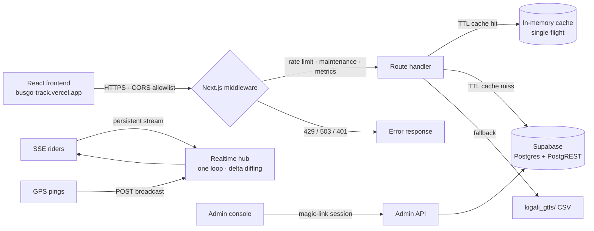

<div align="center">

# BusGo Track — Kigali Transit API

**A realtime transit backend for Kigali's bus network.**
GTFS schedules, crowdsourced live bus positions, delta-compressed SSE streams, an ETA engine, and an admin console that can disable endpoints mid-incident.

</div>

<div align="center">


**Production API:** [`https://tega-transit-api.onrender.com/api`](https://tega-transit-api.onrender.com/api/health) · **Status page:** [`/`](https://tega-transit-api.onrender.com) · **Frontend repo:** `BusGo_Track`

</div>

---

## What this is

BusGo Track is the backend for a Kigali bus-tracking app. It serves the static GTFS feed (stops, routes, shapes, schedules) from Supabase, runs a **realtime hub** that streams bus positions to riders over SSE with delta compression, merges **crowdsourced GPS pings** from riders on the bus, and computes ETA windows from a mix of live positions and schedules.

It also ships a full **admin console** — the same dashboard used to run the service: live per-endpoint load metrics, one-click endpoint disable (real 503s at the middleware), uptime history, an auth audit trail, and a maintenance guide.

**The scaling thesis:** static GTFS data is cached in memory (single-flight), the hot endpoints are micro/TTL-cached so steady traffic stops hammering Postgres, and every request is counted into a per-endpoint metrics ring the admin can watch live. See [Scaling & hardening](#scaling--hardening).

---

## Features

| Area | What you get |
| --- | --- |
| 🚌 **Realtime** | Delta-compressed SSE stream (one hub loop, per-client diffing), crowdsourced pings via `POST /api/realtime/broadcast`, incident alerts pushed to riders in range |
| 🗺 **GTFS** | Kigali feed in Supabase + local CSV fallback — stops, routes, shapes (GeoJSON), route sequences, stop→routes index |
| ⏱ **ETAs** | `eta_v2_predictive` — live buses override schedules, confidence-tagged (`high`/`medium`/`low`) with a min–max window |
| 🛡 **Abuse defense** | Per-IP rate limiting (read 120/min, write 30/min), CORS allowlist, maintenance kill-switch per endpoint, constant-time admin auth |
| 📊 **Admin console** | shadcn dashboard: Issues, **Load** (live metrics), Endpoints (toggle + uptime bars), Suggestions, Admins, Audit, Guide |
| 🔐 **Admin auth** | Supabase magic-link/code login, HttpOnly session cookie, **15-minute idle expiry**, 8h cap, full audit log (durable in Supabase) |
| ⏳ **Observability** | Render-style 90-day uptime bars, per-endpoint request/latency/429 metrics, durable error + auth logs, SSE connection gauge |

<details>
<summary><b>More about the load-metrics ring (click to expand)</b></summary>

Every `/api` request is counted in middleware; route handlers record status + latency. The `Load` section of the admin console polls `/api/admin/metrics` every 10s and shows requests/min, p50/p95 latency, 429 trips, the SSE connection gauge, and a TTL-cache hit rate — per endpoint, sorted by load. Same ring powers the "under attack" signal: a scraper shows up as a 429 spike, not noise.

</details>

---

## Architecture



**Request path in one line:** middleware counts it and enforces limits → the TTL cache absorbs repeat reads → only real misses hit Supabase → every status + latency lands in the metrics ring.

---

## Quick start

<details open>
<summary><b>Prerequisites</b></summary>

- Node.js 20+ and **pnpm** (`corepack enable` or `npm i -g pnpm`)
- A Supabase project (tables + RLS come from `supabase/migrations/`)

</details>

### 1. Install & configure

```bash
pnpm install
# create .env.local with the variables below — the full list is also in render.yaml
```

| Variable | Required | Purpose |
| --- | --- | --- |
| `NEXT_PUBLIC_SUPABASE_URL` | ✅ | Supabase project URL |
| `NEXT_PUBLIC_SUPABASE_PUBLISHABLE_KEY` | ✅ | Anon key for public reads |
| `SUPABASE_SERVICE_ROLE_KEY` | ✅ | Service role for admin RPCs (never ship to clients) |
| `NEXT_SUPABASE_CONNECTION_STRING` | for scripts | Direct/pooled Postgres connection for GTFS import scripts |
| `ADMIN_TOKEN` | ✅ | HMAC session secret (fallback) + legacy header token |
| `ADMIN_SESSION_SECRET` | optional | Separate HMAC secret for admin sessions |
| `ADMIN_EMAILS` | ✅ | Comma-separated emails allowed to log in |
| `FRONTEND_ORIGIN` | optional | CORS allowlist origin (defaults to the deployed frontend) |
| `MAX_SSE_CONNECTIONS` | optional | SSE cap (default 250) |
| `REDIS_URL` / `UPSTASH_REDIS_REST_URL` + `UPSTASH_REDIS_REST_TOKEN` | optional | Upstash Redis — shared TTL cache + rate limiter + live-store pub/sub. Without it, everything degrades to in-memory automatically |
| `LOAD_ALERT_RPM_THRESHOLD` / `LOAD_ALERT_429_THRESHOLD` | optional | Load-alert trip points (defaults 120 req/min, 10 rate-limit trips) |

### 2. Run it

```bash
pnpm dev        # http://localhost:3000
pnpm test       # 178 tests, vitest
pnpm lint       # eslint
pnpm build      # production build (type errors fail it on purpose)
pnpm load-test  # autocannon against localhost only — see "Testing"
```

`/` is the public status page (uptime bars, read-only). `/admin` is the console (login via magic code to `ADMIN_EMAILS`).

---

## API at a glance

Base URL: `https://tega-transit-api.onrender.com/api` (local: `http://localhost:3000/api`)

<details>
<summary><b>System & health</b></summary>

| Endpoint | Purpose |
| --- | --- |
| `GET /api/health` | Liveness ping — the wake-up call for Render cold starts |
| `GET /api/status` | DB connectivity, maintenance flags, SSE + latency telemetry |
| `GET /api/uptime` | 90 days of per-endpoint uptime buckets for the status-page bars |

```bash
curl https://tega-transit-api.onrender.com/api/health
# {"status":"ok","uptime":12345}
```

</details>

<details>
<summary><b>Stops & Arrivals</b></summary>

| Endpoint | Purpose |
| --- | --- |
| `GET /api/stops?lat=&lng=&radius=` | Stops near a GPS point, proximity-sorted |
| `GET /api/stops/{id}/arrivals` | Upcoming ETAs (live + schedule), 5s micro-cached |
| `GET /api/search/suggest?q=` | Typo-tolerant stop search (PostGIS `pg_trgm`), 1h cached |

```bash
curl "https://tega-transit-api.onrender.com/api/search/suggest?q=kacy"
curl "https://tega-transit-api.onrender.com/api/stops/24626187/arrivals"
```

</details>

<details>
<summary><b>GTFS static</b></summary>

| Endpoint | Purpose | Cache |
| --- | --- | --- |
| `GET /api/gtfs/stops` | All stops (name-validated, paginated) | in-memory snapshot |
| `GET /api/gtfs/stops/{id}/routes` | Routes serving a stop | in-memory index |
| `GET /api/gtfs/hubs` | Major hubs (Nyabugogo, Downtown, Remera, Kimironko) | in-memory snapshot |
| `GET /api/gtfs/routes` | All routes | **1h TTL** |
| `GET /api/routes` | Routes with full metadata | **1h TTL** |
| `GET /api/routes/{id}/shape` | GeoJSON LineString for the map | **1 day TTL** (was 3 queries/request) |
| `GET /api/routes/{id}/sequence?direction=` | Ordered stop list for the timeline | **1 day TTL** |

```bash
curl https://tega-transit-api.onrender.com/api/routes/101/shape
```

</details>

<details>
<summary><b>Realtime</b></summary>

| Endpoint | Purpose |
| --- | --- |
| `GET /api/realtime/sse?lat=&lng=&radius=` | Delta-compressed vehicle stream + incidents + viewer counts |
| `POST /api/realtime/broadcast` | Rider "I'm on this bus" GPS ping (speed >120 km/h rejected) |
| `GET /api/vehicles/live` | One-shot vehicle snapshot — the SSE polling fallback |
| `POST /api/incidents/report` | Report traffic / detour / skip-stop from onboard |
| `GET /api/incidents/active` | Currently-active incidents for late joiners |

SSE deltas only carry changed fields (id, lat, lon, brg, spd); static fields ship once per client. `EventSource` auto-reconnects.

</details>

<details>
<summary><b>Community & Admin</b></summary>

| Endpoint | Purpose |
| --- | --- |
| `POST /api/stops/suggest` | Riders propose stop corrections → moderated queue |
| `POST /api/feedback/report` | Bug reports (persisted in Supabase) |
| `GET /api/admin/metrics` | **Live load ring** (admin session required) |
| `GET/POST /api/admin/maintenance` | Durable per-endpoint kill-switch |
| `GET /api/admin/auth-log` | Durable auth audit trail |
| `GET/POST /api/admin/admins` | Invite/revoke admin emails via Supabase |

Full reference with request/response bodies: [`docs/API_DOCS.md`](docs/API_DOCS.md).

</details>

---

## Scaling & hardening

The hot path is designed so "hundreds of people searching" doesn't translate into hundreds of Postgres queries:

1. **TTL cache with single-flight** (`lib/api/ttl-cache.ts`) — first request for a key does the DB query; concurrent callers share that one in-flight promise; everyone else reads memory for the TTL. Failures are never cached. With `REDIS_URL` set, Redis becomes a shared L2 (memory → Redis → DB), so cache warmth survives restarts and spans instances.
2. **Boot-time in-memory snapshots** — the stops table and parsed GTFS CSVs load once per instance (`stops-cache`, `gtfs-parser`).
3. **Cache headers that work** — `max-age` (browser) + `s-maxage` (CDN-ready) so repeat riders skip the server entirely, and a CDN in front (Cloudflare) is a documented upgrade path.
4. **Per-IP rate limiting** — 120 reads / 30 writes per minute per route-group; the limit trips land in the metrics ring.
5. **Rate limiting you can scale** — with Redis, the per-IP window is an atomic INCR/EXPIRE key, so N instances count as ONE budget. Without it, the in-memory window takes over (identical behavior, single instance).
6. **Realtime that spans instances** — broadcast pings and incident reports fan out to every instance via Redis pub/sub (`lib/api/live-sync.ts`), so SSE subscribers on any instance see vehicles reported anywhere. Idempotent applies + backoff reconnect; silent no-op without Redis.

> ⚠️ **Cold starts:** the free Render instance sleeps after ~15 min idle — the first request after a gap can take 20–50s. `docs/API_DOCS.md` documents the layered wake-up strategy for the frontend (ping on mount → skeleton UI → cached snapshot → banner).

---

## Admin console

Sign in at `/goToAdminAuth` with a magic code sent to any `ADMIN_EMAILS` address. Sessions are HttpOnly cookies with **15-minute idle expiry** and an 8-hour cap; every sign-in event lands in the durable audit log.

Sections: **Issues** (errors + bug reports) · **Endpoints** (toggle each endpoint off — middleware returns real 503s — with Render-style uptime bars) · **Load** (live per-endpoint metrics) · **Suggestions** (moderate stop edits) · **Admins** (invite/revoke) · **Audit** (auth trail) · **Guide** (QA reference).

---

## Testing

```bash
pnpm test        # vitest — 203 tests: middleware, caches, auth, routes, metrics, services
pnpm lint        # eslint
pnpm build       # next build with typechecking ON — type errors fail the deploy
pnpm load-test        # autocannon, LOCALHOST ONLY
pnpm load-test:scale  # concurrent search + arrivals + SSE with cache hit-rate, LOCALHOST ONLY
```

`scripts/load-test.mjs` measures real per-endpoint throughput with `autocannon`. **Never point it at the deployed URL** — the free Render tier is ~0.1 vCPU, so a real load test against production *is* a DoS against it. Run it against `pnpm build && pnpm start` locally (`--connections=50 --duration=20` to tune).

`scripts/load-test-scale.mjs` models the actual "hundreds of riders" scenario: a concurrent worker pool hammers search + arrivals while a bank of SSE connections streams vehicle positions, then reports per-endpoint p50/p95/p99 and the **cache hit rate** during the run (reads `/api/admin/metrics` with your `ADMIN_TOKEN`; set the env var or it's picked up from `.env.local`). Same localhost-only guard.

---

## Deployment

Render-only. The `render.yaml` blueprint provisions the web service; every push to `main` auto-deploys. Required env vars are listed above and in the guide.

- [`docs/DEPLOYMENT_GUIDE.md`](docs/DEPLOYMENT_GUIDE.md) — Render setup, env keys, scaling & hardening, removing the stale Vercel integration
- [`supabase/migrations/`](supabase/migrations/) — `0001`–`0012`: tables, RLS, admin RPCs, durable flags/audit/uptime. Apply via SQL editor or `supabase db push`.
- [`scripts/`](scripts/) — GTFS import/upload/cleanup utilities (`push-gtfs.js`, `clean-gtfs-stops.js`, …)

---

## Documentation

| Doc | What's in it |
| --- | --- |
| [`docs/API_DOCS.md`](docs/API_DOCS.md) | Full API reference with bodies, validation rules, frontend strategy |
| [`docs/ADMIN_DASHBOARD_PRD.md`](docs/ADMIN_DASHBOARD_PRD.md) | Admin console product spec |
| [`docs/DEPLOYMENT_GUIDE.md`](docs/DEPLOYMENT_GUIDE.md) | Render deploy + scaling + Vercel teardown |
| [`docs/BACKEND_HANDOFF.md`](docs/BACKEND_HANDOFF.md) | Architecture decisions & gotchas |
| [`docs/DESIGN_TOKENS.md`](docs/DESIGN_TOKENS.md) | Design system tokens |
| [`docs/PROJECT_LOG.md`](docs/PROJECT_LOG.md) | Change history |
| [`/version-log-2026-08-09.html`](public/version-log-2026-08-09.html) | Scaling-batch changelog + frontend consumption guide (also live on the deployed API) |
| [`/CHANGELOG.md`](CHANGELOG.md) | Release index — one-line summary per release, linking to the version log |

---

**Stack:** Next.js 16 (Turbopack) · TypeScript · Supabase (Postgres + PostgREST) · Tailwind CSS v4 · shadcn/ui on Base UI · Zod · Vitest · pnpm · Render
